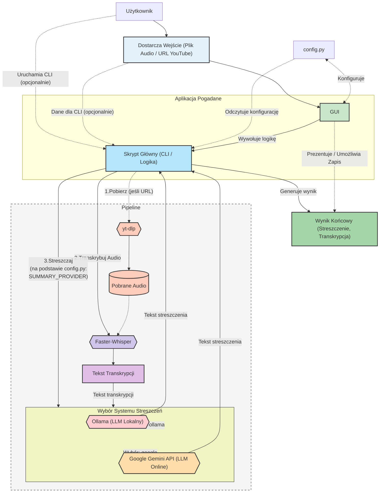

# pogadane


Aplikacja do generowania streszczeń z nagrań audio (np. spotkań Teams, podcastów) lub filmów na YouTube. Działa lokalnie (offline dla transkrypcji i podsumowań Ollama, poza pobieraniem z YouTube), co zapewnia bezpieczeństwo danych. Umożliwia szybkie uzyskanie najważniejszych informacji z długich materiałów. Od wersji v0.1.7 wspiera również Google Gemini API jako alternatywnego dostawcę podsumowań.

Projekt zawiera zarówno interfejs linii komend (CLI) `transcribe_summarize_working.py`, jak i interfejs graficzny użytkownika (GUI) `gui.py`.

**Spis Treści**
1.  [Architektura Systemu](#architektura-systemu)
2.  [Wymagania Wstępne](#wymagania-wstępne)
3.  [Konfiguracja](#konfiguracja)
4.  [Instalacja Komponentów](#instalacja-komponentów)
    * [Krok 1: Instalacja środowiska Python](#krok-1-instalacja-środowiska-python)
    * [Krok 2: Instalacja Faster-Whisper Standalone](#krok-2-instalacja-faster-whisper-standalone)
    * [Krok 3: Pobranie yt-dlp](#krok-3-pobranie-yt-dlp-do-obsługi-youtube)
    * [Krok 4: Instalacja Systemu Podsumowań](#krok-4-instalacja-systemu-podsumowań)
        * [Opcja A: Instalacja Ollama i Pobranie Modelu Językowego (Lokalnie)](#opcja-a-instalacja-ollama-i-pobranie-modelu-językowego-lokalnie)
        * [Opcja B: Konfiguracja Google Gemini API (Online)](#opcja-b-konfiguracja-google-gemini-api-online)
    * [Krok 5: Instalacja biblioteki GUI](#krok-5-instalacja-biblioteki-gui-ttkbootstrap)
5.  [Uruchomienie Aplikacji](#uruchomienie-aplikacji)
    * [Uruchomienie Interfejsu Graficznego (GUI) (Wersja Alpha v0.1.7+) (Zalecane)](#uruchomienie-interfejsu-graficznego-gui-wersja-alpha-v017-zalecane)
    * [Uruchomienie Skryptu z Linii Komend (CLI) (Wersja Alpha v0.1.7+)](#uruchomienie-skryptu-z-linii-komend-cli-wersja-alpha-v017)
6.  [Poprzednie Wersje](#poprzednie-wersje)

---
## Architektura Systemu

Poniższy diagram przedstawia ogólną architekturę aplikacji "pogadane":



**Opis komponentów:**

  * **Użytkownik**: Osoba inicjująca proces transkrypcji i streszczenia.
  * **Wejście (Plik Audio / URL YouTube)** (`input_source`): Plik audio dostarczony przez użytkownika lub adres URL do materiału na YouTube.
  * **config.py** (`config_file`): Plik konfiguracyjny aplikacji, zawierający ustawienia takie jak ścieżki do narzędzi, wybór modeli, parametry transkrypcji, dostawcę podsumowań oraz prompt dla LLM.
  * **Aplikacja Pogadane** (`pogadane_app`): Główny kontener aplikacji:
      * **Interfejs Graficzny (GUI)** (`gui_app`): Zalecany sposób interakcji. Umożliwia wprowadzenie danych, zarządzanie konfiguracją (`config.py`) i wyświetlanie wyników. Wywołuje Skrypt Główny.
      * **Skrypt Główny (CLI / Logika)** (`cli_script`): Plik `transcribe_summarize_working.py`. Rdzeń logiki: pobieranie audio, transkrypcja, generowanie streszczenia. Może być uruchamiany bezpośrednio lub przez GUI.
  * **Potok Przetwarzania** (`processing_pipeline`): Sekwencja operacji:
      * **yt-dlp** (`yt_dlp`): Narzędzie do pobierania audio z URL.
      * **Pobrane Audio** (`downloaded_audio`): Tymczasowy plik audio.
      * **Faster-Whisper** (`faster_whisper`): Narzędzie do transkrypcji audio na tekst (z opcjonalną diaryzacją).
      * **Tekst Transkrypcji** (`transcription_text`): Wynik działania `Faster-Whisper`.
      * **Wybór Systemu Streszczeń** (`summarization_choice`): Logika w skrypcie decydująca na podstawie `config.py` (`SUMMARY_PROVIDER`), który system LLM zostanie użyty.
          * **Ollama (LLM Lokalny)** (`ollama_sum`): Platforma uruchamiająca lokalnie duże modele językowe (np. Gemma) do generowania streszczenia.
          * **Google Gemini API (LLM Online)** (`google_gemini_sum`): Usługa Google Cloud AI do generowania streszczenia przy użyciu modeli Gemini. Wymaga klucza API i połączenia z internetem.
  * **Wynik Końcowy** (`final_output`): Streszczenie i transkrypcja, prezentowane w GUI lub zapisywane do plików.

-----

## Wymagania Wstępne

  * System operacyjny Windows.
  * Python (zalecany 3.7+).
  * Połączenie z Internetem (do pobrania oprogramowania, materiałów z YouTube oraz opcjonalnie do korzystania z Google Gemini API).
  * Uprawnienia administratora mogą być wymagane do instalacji niektórych programów.
  * Narzędzie do dekompresji archiwów `.7z` (np. [7-Zip](https://www.7-zip.org/)).

-----

## Konfiguracja

Skrypt `transcribe_summarize_working.py` oraz interfejs `gui.py` zarządzają konfiguracją w następujący sposób:

1.  **Plik `config.py` (Zalecane):** Aplikacja w pierwszej kolejności próbuje załadować konfigurację z pliku `config.py`. **Plik `config.py` z domyślnymi ustawieniami jest dołączony do repozytorium.**
      * **Edycja przez GUI:** Możesz wygodnie edytować większość opcji konfiguracyjnych bezpośrednio w zakładce "⚙️ Konfiguracja" w aplikacji GUI. Zmiany są zapisywane do pliku `config.py`.
      * **Edycja Manualna:** Możesz również bezpośrednio edytować plik `config.py`.
2.  **Konfiguracja Domyślna (Fallback):** Jeśli plik `config.py` nie zostanie znaleziony, skrypt CLI i GUI użyją predefiniowanych wartości domyślnych.

**Aby dostosować konfigurację, zaleca się użycie zakładki "Konfiguracja" w GUI lub edycję pliku `config.py`.**

Zawartość przykładowego pliku `config.py` (który jest również plikiem domyślnym w repozytorium):

```python
# config.py
# Plik konfiguracyjny dla skryptu transcribe_summarize_working.py
# oraz Pogadane GUI. Zmiany w GUI są zapisywane tutaj.

# --- Configuration ---

# Ścieżki do plików wykonywalnych
FASTER_WHISPER_EXE = "faster-whisper-xxl.exe"
YT_DLP_EXE = "yt-dlp.exe"

# Ustawienia Whisper
WHISPER_LANGUAGE = "Polish"  # Język transkrypcji (np. "Polish", "English")
WHISPER_MODEL = "turbo"     # Model Faster Whisper

# --- Ustawienia Diaryzacji Mówców ---
ENABLE_SPEAKER_DIARIZATION = False
DIARIZE_METHOD = "pyannote_v3.1"
DIARIZE_SPEAKER_PREFIX = "MÓWCA"

# --- Ustawienia Podsumowania ---
SUMMARY_PROVIDER = "ollama" # Dostawca podsumowania: "ollama" (lokalnie) lub "google" (Google Gemini API)
SUMMARY_LANGUAGE = "Polish" # Język, w którym ma być wygenerowane podsumowanie

# Ustawienia Ollama (jeśli SUMMARY_PROVIDER="ollama")
OLLAMA_MODEL = "gemma3:4b"

# Ustawienia Google Gemini API (jeśli SUMMARY_PROVIDER="google")
GOOGLE_API_KEY = ""  # Wymagany, jeśli SUMMARY_PROVIDER="google". Wklej tutaj swój klucz API.
GOOGLE_GEMINI_MODEL = "gemini-1.5-flash-latest"

# Prompt dla modelu językowego (Ollama/Google).
# To jest główna część instrukcji, np. "Streść poniższy tekst..."
# Skrypt automatycznie doda instrukcję językową i tekst transkrypcji.
LLM_PROMPT = "Streść poniższy tekst, skupiając się na kluczowych wnioskach i decyzjach:"

# Ustawienia Ogólne Skryptu
TRANSCRIPTION_FORMAT = "txt"
DOWNLOADED_AUDIO_FILENAME = "downloaded_audio.mp3"

# --- End Configuration ---
```

**Opis opcji konfiguracyjnych (dostępnych w `config.py` oraz w GUI):**

  * `FASTER_WHISPER_EXE`: Ścieżka do `faster-whisper-xxl.exe`.
  * `YT_DLP_EXE`: Ścieżka do `yt-dlp.exe`.
  * `WHISPER_LANGUAGE`: Język transkrypcji dla Faster Whisper (domyślnie "Polish").
  * `WHISPER_MODEL`: Model Faster Whisper (domyślnie "turbo").
  * `ENABLE_SPEAKER_DIARIZATION`: Włącza/wyłącza diaryzację mówców (domyślnie `False`).
  * `DIARIZE_METHOD`: Metoda diaryzacji (np. `"pyannote_v3.1"`).
  * `DIARIZE_SPEAKER_PREFIX`: Prefiks dla mówców (np. `"MÓWCA"`).
  * `SUMMARY_PROVIDER`: Wybór systemu do generowania podsumowań. Dostępne opcje: `"ollama"` (domyślnie, lokalnie) lub `"google"` (wymaga `GOOGLE_API_KEY` i połączenia z internetem).
  * `SUMMARY_LANGUAGE`: Język, w którym ma być wygenerowane podsumowanie (domyślnie "Polish").
  * `OLLAMA_MODEL`: Model językowy Ollama (używany, gdy `SUMMARY_PROVIDER="ollama"`, domyślnie "gemma3:4b").
  * `GOOGLE_API_KEY`: Klucz API do Google Gemini (wymagany, gdy `SUMMARY_PROVIDER="google"`). **Pamiętaj, aby go uzupełnić\!**
  * `GOOGLE_GEMINI_MODEL`: Model Google Gemini (używany, gdy `SUMMARY_PROVIDER="google"`, domyślnie "gemini-1.5-flash-latest").
  * `LLM_PROMPT`: Główna część promptu używanego do generowania podsumowania. Skrypt automatycznie dołączy instrukcję językową (`SUMMARY_LANGUAGE`) oraz tekst transkrypcji.
  * `DOWNLOADED_AUDIO_FILENAME`: Nazwa tymczasowego pliku audio pobieranego z YouTube.
  * `TRANSCRIPTION_FORMAT`: Format pliku wyjściowego transkrypcji używany wewnętrznie przez skrypt CLI (domyślnie 'txt').

-----

## Instalacja Komponentów

### Krok 1: Instalacja środowiska Python

1.  **Pobierz Instalator Python:** Przejdź na oficjalną stronę Python ([https://www.python.org/downloads/windows/](https://www.python.org/downloads/windows/)) i pobierz najnowszy stabilny instalator dla systemu Windows (np. "Windows installer (64-bit)").
2.  **Uruchom Instalator:** Otwórz pobrany plik `.exe`.
3.  **Konfiguracja Instalacji:** **Bardzo ważne:** W pierwszym oknie instalatora zaznacz opcję **"Add Python X.Y to PATH"** (gdzie X.Y to numer wersji). Następnie kliknij "Install Now".
4.  **Weryfikacja Instalacji:** Po zakończeniu instalacji otwórz terminal PowerShell (możesz go znaleźć, wpisując "PowerShell" w menu Start) i wpisz polecenie:
    ```powershell
    python --version
    ```
    Jeśli instalacja przebiegła poprawnie, wyświetlona zostanie zainstalowana wersja Pythona.

### Krok 2: Instalacja Faster-Whisper Standalone

1.  **Pobierz Faster-Whisper:** Przejdź do repozytorium GitHub Purfview/whisper-standalone-win w sekcji Releases ([Release Faster-Whisper-XXL r245.4 · Purfview/whisper-standalone-win](https://www.google.com/search?q=https://github.com/Purfview/whisper-standalone-win/releases/tag/Faster-Whisper-XXL)). Znajdź wersję `Faster-Whisper-XXL r245.4` (lub nowszą, która wspiera diaryzację) i pobierz archiwum dla Windows: `Faster-Whisper-XXL_r245.4_windows.7z`.
2.  **Rozpakuj Archiwum:** Użyj narzędzia typu 7-Zip, aby wypakować zawartość pobranego archiwum do wybranej przez siebie lokalizacji (np. `C:\pogadane_narzedzia`). W wyniku powstanie folder, np. `C:\pogadane_narzedzia\Faster-Whisper-XXL_r245.4_windows`.
3.  **Zlokalizuj Katalog Główny Faster-Whisper:** Wewnątrz rozpakowanego folderu znajduje się podkatalog `\Faster-Whisper-XXL` zawierający plik wykonywalny `faster-whisper-xxl.exe`. Skonfiguruj ścieżkę do tego pliku w `config.py` (lub w GUI) albo umieść go w katalogu projektu.

### Krok 3: Pobranie yt-dlp (do obsługi YouTube)

1.  **Pobierz yt-dlp:** Przejdź na stronę najnowszych wydań projektu yt-dlp na GitHub: [https://www.google.com/search?q=https://github.com/yt-dlp/yt-dlp/releases/latest](https://www.google.com/search?q=https://github.com/yt-dlp/yt-dlp/releases/latest).
2.  **Pobierz Plik:** Znajdź i pobierz plik `yt-dlp.exe`.
3.  **Umieść Plik:** Skopiuj pobrany plik `yt-dlp.exe` do katalogu, w którym znajdują się skrypty `gui.py` i `transcribe_summarize_working.py`, lub skonfiguruj ścieżkę w `config.py` (lub w GUI).

### Krok 4: Instalacja Systemu Podsumowań

Masz dwie opcje generowania podsumowań: lokalnie za pomocą Ollama lub online przez Google Gemini API.

#### Opcja A: Instalacja Ollama i Pobranie Modelu Językowego (Lokalnie)

Jeśli chcesz generować podsumowania lokalnie (zalecane dla prywatności i działania offline):

1.  **Pobierz Ollama:** Przejdź na oficjalną stronę Ollama ([https://ollama.com/](https://ollama.com/)) i pobierz wersję dla Windows.
2.  **Zainstaluj Ollama:** Uruchom instalator.
3.  **Pobierz Model Językowy:** Otwórz terminal PowerShell i wykonaj polecenie, aby pobrać model zdefiniowany w `config.py` (domyślnie `OLLAMA_MODEL="gemma3:4b"`):
    ```powershell
    ollama pull gemma3:4b
    ```
    (Jeśli zmieniłeś `OLLAMA_MODEL` w konfiguracji, użyj tutaj odpowiedniej nazwy modelu).
4.  **Sprawdź Działanie Ollama:** Upewnij się, że Ollama działa w tle (`ollama list`).
5.  **Konfiguracja w `pogadane`:** W pliku `config.py` (lub przez GUI) ustaw `SUMMARY_PROVIDER = "ollama"`.

#### Opcja B: Konfiguracja Google Gemini API (Online)

Jeśli chcesz używać Google Gemini API do generowania podsumowań (wymaga połączenia z internetem i klucza API):

1.  **Uzyskaj Klucz API Google Gemini:**
      * Przejdź do Google AI Studio ([https://aistudio.google.com/](https://aistudio.google.com/)).
      * Zaloguj się kontem Google.
      * Utwórz nowy projekt lub wybierz istniejący.
      * Wygeneruj klucz API ("Get API key"). Skopiuj go i przechowuj w bezpiecznym miejscu.
2.  **Zainstaluj bibliotekę Python:** Otwórz terminal PowerShell i wpisz:
    ```powershell
    pip install google-generativeai
    ```
3.  **Konfiguracja w `pogadane`:**
      * Otwórz plik `config.py` (lub użyj GUI).
      * Ustaw `SUMMARY_PROVIDER = "google"`.
      * Wklej swój klucz API do `GOOGLE_API_KEY = "TWOJ_KLUCZ_API_TUTAJ"`.
      * Możesz również dostosować `GOOGLE_GEMINI_MODEL` (domyślnie "gemini-1.5-flash-latest").

### Krok 5: Instalacja biblioteki GUI (ttkbootstrap)

Aby uruchomić interfejs graficzny, potrzebna jest biblioteka `ttkbootstrap`. Zainstaluj ją używając pip:

1.  Otwórz terminal PowerShell.
2.  Wpisz polecenie:
    ```powershell
    pip install ttkbootstrap
    ```
    Poczekaj na zakończenie instalacji.

-----

## Uruchomienie Aplikacji

1.  **Pobierz/Skopiuj Skrypty:** Upewnij się, że masz najnowsze wersje plików `gui.py`, `transcribe_summarize_working.py` oraz `config.py` z repozytorium. Umieść je wszystkie w jednym katalogu.
2.  **Dostosuj `config.py`:** Upewnij się, że `config.py` jest poprawnie skonfigurowany, zwłaszcza jeśli wybrałeś Google Gemini API (wymagany `GOOGLE_API_KEY`).

### Uruchomienie Interfejsu Graficznego (GUI) (Wersja Alpha v0.1.7+) (Zalecane)

Interfejs graficzny `gui.py` jest zalecanym sposobem korzystania z aplikacji.

1.  **Otwórz Terminal:** Otwórz terminal PowerShell.
2.  **Przejdź do Katalogu Projektu:** Użyj polecenia `cd`, aby przejść do katalogu, w którym umieściłeś pliki `gui.py`, `transcribe_summarize_working.py` i `config.py`.
    ```powershell
    cd "C:\Sciezka\Do\Twojego\Katalogu\Pogadane"
    ```
3.  **Uruchom GUI:** Wpisz polecenie:
    ```powershell
    python gui.py
    ```
4.  **Korzystanie z GUI:**
      * **Dane Wejściowe:** Wprowadź ścieżkę do lokalnego pliku audio lub URL YouTube w polu na górze. Możesz użyć przycisku "📂" do przeglądania plików.
      * **Konfiguracja:** Przejdź do zakładki "⚙️ Konfiguracja", aby dostosować ustawienia (ścieżki do programów, modele, język, dostawca podsumowań, klucz API Google, prompt itp.). Pamiętaj, aby kliknąć "💾 Zapisz i Zastosuj", aby zmiany zostały zapisane w `config.py` i uwzględnione.
      * **Uruchomienie:** Kliknij przycisk "🚀 Transkrybuj i Streść".
      * **Wyniki:** Postęp i logi będą widoczne w zakładce "🖥️ Konsola". Gotowa transkrypcja pojawi się w "📝 Transkrypcja", a streszczenie w "📌 Streszczenie".
      * **Zapisywanie:** Użyj przycisków "💾 Zapisz" lub "📁 Zapisz Jako..." w odpowiednich zakładkach, aby zapisać log, transkrypcję lub streszczenie.

### Uruchomienie Skryptu z Linii Komend (CLI) (Wersja Alpha v0.1.7+)

Skrypt `transcribe_summarize_working.py` może być również uruchamiany bezpośrednio z linii komend.

1.  **Otwórz Terminal w Odpowiedniej Lokalizacji:** Otwórz terminal PowerShell. Użyj polecenia `cd` (change directory), aby przejść do katalogu, w którym umieściłeś skrypt `transcribe_summarize_working.py` oraz `config.py`.

2.  **Wykonaj Polecenie Uruchomienia Skryptu:** W terminalu PowerShell wpisz polecenie `python`, nazwę skryptu, ścieżkę do pliku audio LUB URL YouTube, opcjonalnie flagę `--diarize` LUB `--no-diarize` oraz opcjonalnie flagę `-o` ze ścieżką do pliku wyjściowego dla podsumowania.

    **Ogólny wzór:**

    ```powershell
    python transcribe_summarize_working.py "<ścieżka_do_pliku_LUB_URL_YouTube>" [--diarize | --no-diarize] -o "<pełna_ścieżka_do_pliku_z_podsumowaniem.txt>"
    ```

      * Flagi `--diarize` lub `--no-diarize` nadpisują ustawienie `ENABLE_SPEAKER_DIARIZATION` z `config.py`. Jeśli żadna z tych flag nie jest użyta, wartość brana jest z `config.py`.

    **Przykład 1: Użycie pliku lokalnego z włączoną diaryzacją**

    ```powershell
    python transcribe_summarize_working.py "C:\Users\Moje\Desktop\nagranie_spotkania.mp3" --diarize -o "C:\Users\alexk\Desktop\nagranie_spotkania_summary.txt"
    ```

    **Przykład 2: Użycie adresu URL YouTube (ustawienie diaryzacji z `config.py`)**

    ```powershell
    python transcribe_summarize_working.py "[https://www.youtube.com/watch?v=przykladowyFilm](https://www.youtube.com/watch?v=przykladowyFilm)" -o "C:\Users\Moje\Dokumenty\podsumowanie_wykladu.txt"
    ```

3.  **Monitoruj Proces:** Skrypt rozpocznie działanie. W terminalu pojawią się komunikaty informujące o postępie. Podsumowanie zostanie zapisane w pliku podanym po fladze `-o`. Jeśli flaga `-o` nie zostanie użyta, podsumowanie zostanie tylko wyświetlone w terminalu.

-----

## Poprzednie Wersje

Historyczne wersje skryptu są archiwizowane w katalogu `previous_versions` w repozytorium projektu.