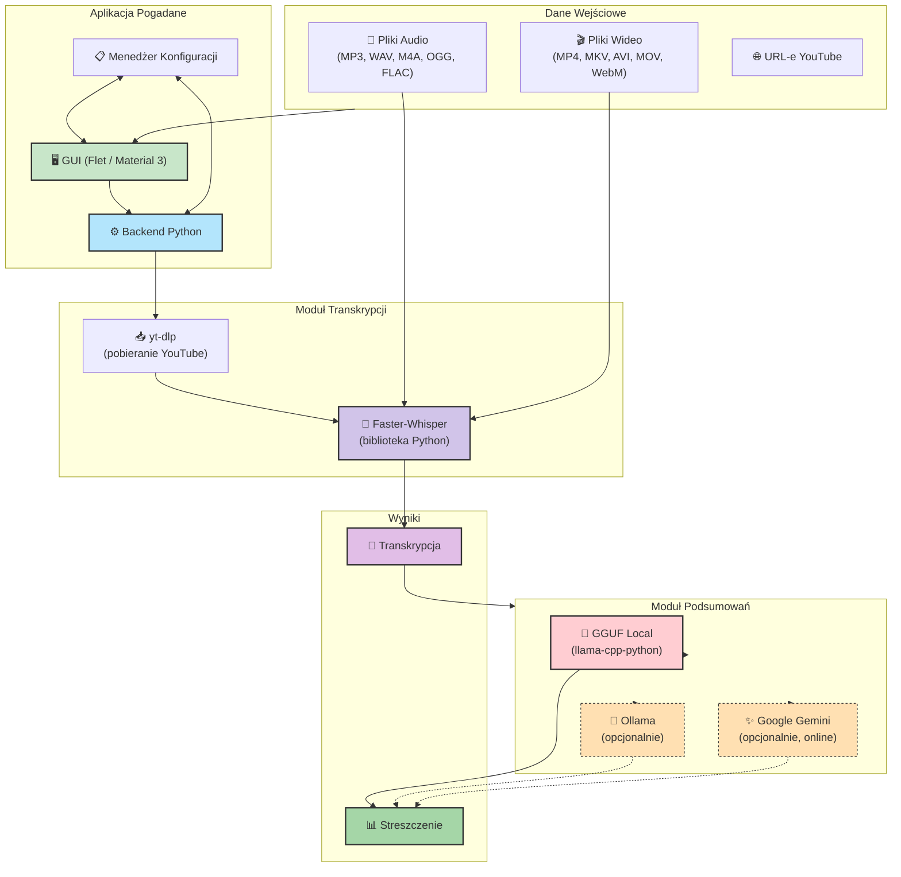

# Pogadane

<p align="center">
  
</p>

Aplikacja do generowania streszczeń z nagrań audio (np. spotkań Teams, podcastów) lub filmów na YouTube. Działa lokalnie (offline) dzięki modelom GGUF i Faster-Whisper, co zapewnia bezpieczeństwo danych. Umożliwia szybkie uzyskanie najważniejszych informacji z długich materiałów.

Wersja **v0.1.8** wprowadza:
- 🚀 Nowoczesny interfejs Material 3 (Flet)
- 🧠 Lokalne modele GGUF (llama-cpp-python)
- ⚡ 4x szybszą transkrypcję (faster-whisper jako biblioteka Python)
- 📦 Uproszczoną instalację przez `install.py`
- 🌐 Opcjonalną integrację z Google Gemini API

**Spis treści**
1. [Architektura Systemu](#architektura-systemu)
2. [Wymagania Wstępne](#wymagania-wstępne)
3. [Instalacja](#instalacja)
4. [Konfiguracja Modelu GGUF](#konfiguracja-modelu-gguf)
5. [Uruchomienie Aplikacji](#uruchomienie-aplikacji)
6. [Konfiguracja](#konfiguracja)
7. [Struktura Projektu](#struktura-projektu)
8. [Rozwój (Development)](#rozwój-development)
9. [Licencja](#licencja)

---

## Architektura Systemu



**Opis komponentów:**

| Komponent | Opis |
|-----------|------|
| **GUI (Flet)** | Nowoczesny interfejs Material 3 z obsługą przeciągnij-i-upuść, kolejką przetwarzania i menedżerem wyników |
| **Backend** | Logika aplikacji: orkiestracja transkrypcji i podsumowań |
| **yt-dlp** | Pobieranie audio z YouTube (biblioteka Python) |
| **Faster-Whisper** | Szybka transkrypcja mowy (CTranslate2, 4x szybsza niż OpenAI Whisper) |
| **GGUF Local** | Lokalne modele LLM przez llama-cpp-python (domyślnie Gemma 3 4B) |
| **Ollama** | Opcjonalny backend dla lokalnych LLM |
| **Google Gemini** | Opcjonalna integracja z chmurą Google AI |

---

## Wymagania Wstępne

- **Python 3.9+** (zalecany 3.11+)
- **System operacyjny**: Windows, Linux lub macOS
- **RAM**: minimum 8 GB (16 GB zalecane dla modeli GGUF)
- **Miejsce na dysku**: ~3 GB (model GGUF + zależności)

---

## Instalacja

### Krok 1: Klonowanie repozytorium

```powershell
git clone https://github.com/WSB-University-Problem-Based-Learning/pogadane.git
cd pogadane
```

### Krok 2: Utworzenie środowiska wirtualnego

```powershell
cd _app
python -m venv .venv

# Windows (PowerShell)
.\.venv\Scripts\Activate.ps1

# Windows (CMD)
.\.venv\Scripts\activate.bat

# Linux / macOS
source .venv/bin/activate
```

### Krok 3: Instalacja zależności

```powershell
python install.py
```

Skrypt `install.py` automatycznie zainstaluje:
- `flet` - framework GUI
- `yt-dlp` - pobieranie z YouTube
- `faster-whisper` - transkrypcja audio
- `llama-cpp-python` - lokalne modele GGUF
- `google-generativeai` - opcjonalna integracja z Gemini

---

## Konfiguracja Modelu GGUF

Aby używać lokalnych podsumowań (bez internetu), pobierz model GGUF:

1. **Pobierz model** z [HuggingFace - Gemma 3 4B GGUF](https://huggingface.co/google/gemma-3-4b-it-GGUF)
   - Zalecany plik: `gemma-3-4b-it-Q4_K_M.gguf` (~2.5 GB)

2. **Umieść w katalogu modeli**:
   ```
   _app/dep/models/gemma-3-4b-it-Q4_K_M.gguf
   ```

3. **Gotowe!** Aplikacja automatycznie wykryje model.

> **Uwaga:** Jeśli korzystasz z modeli Gemma, zapoznaj się z warunkami licencjonowania w pliku [NOTICES.md](NOTICES.md).

---

## Uruchomienie Aplikacji

### Windows (najprostszy sposób)

Kliknij dwukrotnie na jeden z plików w katalogu głównym:
- `Pogadane.exe` - launcher EXE
- `Pogadane.bat` - launcher BAT

### Z linii komend

```powershell
cd _app
python -m pogadane
```

### Korzystanie z GUI

1. **Dodaj pliki** - Przeciągnij i upuść pliki audio/wideo lub wklej URL-e YouTube
2. **Skonfiguruj** - Opcjonalnie dostosuj ustawienia w panelu ⚙️ Konfiguracja
3. **Przetwórz** - Kliknij "🚀 Rozpocznij Przetwarzanie"
4. **Przeglądaj wyniki** - Transkrypcja i streszczenie pojawią się w zakładce 📊 Wyniki

### Obsługiwane formaty

| Typ | Formaty |
|-----|---------|
| **Audio** | MP3, WAV, M4A, OGG, FLAC |
| **Wideo** | MP4, MKV, AVI, MOV, WebM |
| **Online** | URL-e YouTube |

---

## Konfiguracja

Ustawienia można edytować:
- **W GUI**: Zakładka ⚙️ Konfiguracja
- **Ręcznie**: Plik `_app/.config/config.py`

### Główne opcje konfiguracyjne

| Opcja | Domyślnie | Opis |
|-------|-----------|------|
| `WHISPER_MODEL` | `turbo` | Model Whisper (`tiny`, `base`, `small`, `medium`, `large-v3`, `turbo`) |
| `WHISPER_LANGUAGE` | `Polish` | Język transkrypcji |
| `SUMMARY_PROVIDER` | `gguf` | Dostawca podsumowań (`gguf`, `ollama`, `google`) |
| `SUMMARY_LANGUAGE` | `Polish` | Język podsumowania |
| `GGUF_MODEL_PATH` | `dep/models/gemma-3-4b-it-Q4_K_M.gguf` | Ścieżka do modelu GGUF |
| `GGUF_GPU_LAYERS` | `0` | Liczba warstw na GPU (0 = tylko CPU) |
| `LLM_PROMPT_TEMPLATE_NAME` | `Standardowy` | Wybrany szablon promptu |

### Szablony promptów LLM

Dostępne predefiniowane szablony:

| Nazwa | Zastosowanie |
|-------|--------------|
| **Standardowy** | Ogólne streszczenie z kluczowymi wnioskami |
| **Elementy Akcji** | Lista zadań do wykonania (action items) |
| **Główne Tematy** | Wylistowanie głównych tematów |
| **Kluczowe Pytania** | Pytania wymagające dalszej analizy |
| **ELI5** | Proste wyjaśnienie (Explain Like I'm 5) |

Możesz również zdefiniować własny prompt w polu "Własny prompt".

### Alternatywni dostawcy podsumowań

#### Ollama (lokalnie)

```powershell
# Zainstaluj Ollama: https://ollama.com/
ollama pull gemma3:4b
```

W konfiguracji ustaw:
- `SUMMARY_PROVIDER = "ollama"`
- `OLLAMA_MODEL = "gemma3:4b"`

#### Google Gemini (online)

1. Uzyskaj klucz API: [Google AI Studio](https://aistudio.google.com/)
2. W konfiguracji ustaw:
   - `SUMMARY_PROVIDER = "google"`
   - `GOOGLE_API_KEY = "twój-klucz-api"`

---

## Struktura Projektu

```
pogadane/
├── 📄 Pogadane.bat          # Launcher Windows (BAT)
├── 📄 Pogadane.exe          # Launcher Windows (EXE)
├── 📄 README.md             # Ten plik
├── 📄 LICENSE               # Licencja MIT
├── 📄 NOTICES.md            # Informacje o licencjach third-party
├── 📄 .gitignore
│
├── 📁 _app/                 # APLIKACJA
│   ├── 📁 src/pogadane/     # Kod źródłowy Python
│   │   ├── __main__.py      # Punkt wejścia
│   │   ├── gui_flet.py      # Interfejs GUI (Flet)
│   │   ├── backend.py       # Logika przetwarzania
│   │   ├── llm_providers.py # Dostawcy LLM (GGUF, Ollama, Gemini)
│   │   ├── transcription_providers.py  # Transkrypcja (Faster-Whisper)
│   │   ├── config_loader.py # Ładowanie konfiguracji
│   │   └── constants.py     # Stałe i wartości domyślne
│   ├── 📁 res/assets/       # Zasoby (ikony, animacje)
│   ├── 📁 dep/models/       # Modele GGUF (nie w git)
│   ├── 📁 .venv/            # Środowisko wirtualne (nie w git)
│   ├── 📁 .config/          # Konfiguracja użytkownika
│   ├── 📄 install.py        # Skrypt instalacyjny
│   └── 📄 pyproject.toml    # Metadane projektu
│
└── 📁 _dev/                 # DEVELOPMENT
    ├── 📁 test/             # Testy jednostkowe (pytest)
    ├── 📁 doc/              # Dokumentacja dodatkowa
    ├── 📁 samples/          # Przykładowe pliki testowe (nie w git)
    ├── 📁 build/            # Wyjście PyInstaller (nie w git)
    └── 📄 create_launcher.py # Generator launcherów
```

---

## Rozwój (Development)

### Instalacja narzędzi deweloperskich

```powershell
cd _app
python install.py --dev
```

Zainstaluje dodatkowo: `pytest`, `pytest-cov`, `black`, `pylint`

### Uruchamianie testów

```powershell
cd ..  # wróć do katalogu głównego
pytest _dev/test/ -v
```

### Formatowanie kodu

```powershell
black _app/src/pogadane/
```

### Tworzenie launczera EXE

```powershell
python _dev/create_launcher.py
```

---

## Licencja

Projekt udostępniony na licencji **MIT** - zobacz plik [LICENSE](LICENSE).

Informacje o licencjach bibliotek zewnętrznych: [NOTICES.md](NOTICES.md)

---

<p align="center">
  <strong>Pogadane</strong> © 2024 WSB University - Problem Based Learning
</p>

