# Pogadane

<p align="center">
  
</p>

<p align="center">
  <strong>Transform audio recordings and YouTube videos into transcripts and AI-powered summaries</strong>
</p>

<p align="center">
  <a href="#quick-links">Quick Links</a> •
  <a href="#features">Features</a> •
  <a href="#installation">Installation</a> •
  <a href="#documentation">Documentation</a> •
  <a href="#license">License</a>
</p>

---

<!-- English quick start note -->
**Uwaga (EN):** Sekcja szybkiego startu w języku angielskim znajduje się dalej w tym pliku — zobacz "Quick Start (English)".


## Overview

**Pogadane** is a privacy-focused application for generating transcripts and summaries from audio recordings (e.g., Teams meetings, podcasts) or YouTube videos. It runs locally (offline for transcription and Ollama summaries, except YouTube downloads), ensuring data security. Get the most important information from long materials quickly.

Version **v0.1.8** includes:
- 🎯 LLM prompt template selection
- 📦 Batch processing in CLI and GUI
- 📊 Results manager in GUI
- 🔤 Font size adjustment
- 🩺 `pogadane_doctor.py` setup tool

The project includes:
- **CLI**: `src/pogadane/transcribe_summarize_working.py`
- **GUI**: `src/pogadane/gui.py` (recommended)
- **Setup Tool**: `tools/pogadane_doctor.py`

User settings are in `.config/config.py`.

---

## Quick Links

| 📚 For Everyone | 👨‍💻 For Developers |
|----------------|---------------------|
| [🚀 **GUI Installer (NEW!)**](INSTALL.md) | [🏗️ Technical Architecture](doc/ARCHITECTURE.md) |
| [� **Command-Line Installer**](INSTALL.md) | [📖 API Documentation](#cli-architecture) |
| [⚙️ Manual Installation](#instalacja-i-konfiguracja-zalecane-użycie-pogadane_doctorpy) | [� Contributing Guidelines](#development-guidelines) |
| [🎬 How to Use](#uruchomienie-aplikacji-wersja-alpha-v018) | [🧪 Testing Guide](test/README.md) |
| [❓ Troubleshooting](#troubleshooting) | [🔐 Security Considerations](doc/ARCHITECTURE.md#security-considerations) |
| [📄 License Information](doc/NOTICES.md) | [� Package Structure](dep/STRUCTURE.md) |

---

## Features

### Core Capabilities

✅ **Dual Interface**
- 🎨 **Material Design GUI** (`gui_material.py`) - Modern Material Design 3 with dark/light themes
- 🖥️ **Legacy GUI** (`gui.py`) - Stable Bootstrap-style interface
- ⌨️ **Command-line** - For automation and advanced users

✅ **Multiple Input Sources**
- 📁 Local audio files (MP3, WAV, M4A, OGG, FLAC)
- 🎬 YouTube videos (automatic audio extraction)
- 📦 Batch processing of multiple files/URLs

✅ **Powerful Transcription**
- 🎙️ **Faster-Whisper** (default): GPU acceleration, speaker diarization
- ⚡ **Whisper (Python)**: Lightweight, pure Python, no external executables
- 🌍 Multi-language support
- 👥 Speaker diarization (Faster-Whisper only)
- 🎯 Multiple model sizes (tiny to large)

✅ **Flexible AI Summarization**
- 🏠 **Local (Ollama)**: Complete privacy, offline operation after setup
- ⚡ **Local (Transformers)**: Lightweight Python-based, no Ollama needed
- ☁️ **Cloud (Google Gemini)**: API-based, requires internet connection
- 📝 Customizable prompt templates
- 🌐 Multi-language summaries

✅ **Privacy & Security**
- 🔒 Local processing option (no data leaves your computer)
- 🔓 Open source (inspect the code yourself)
- 🚫 No accounts or registrations required

### User Experience

- 🎨 **Two Modern GUIs** - Choose Material Design or Legacy Bootstrap
  - 🌙 Material Design with dark/light theme toggle
  - 🎯 Clean, rounded corners and card layouts
  - See [GUI Comparison](doc/GUI_COMPARISON.md) for details
- 📊 Real-time progress tracking
- 📋 Results manager with per-file views
- 🔤 Adjustable font sizes for accessibility
- 💾 Easy result export
- 🩺 Automated setup with doctor script

---

**Spis Treści (Table of Contents)**
1.  [Struktura Katalogów](#struktura-katalogów)
2.  [Architektura Systemu](#architektura-systemu)
3.  [Wymagania Wstępne](#wymagania-wstępne)
4.  [Instalacja i Konfiguracja (zalecane użycie `pogadane_doctor.py`)](#instalacja-i-konfiguracja-zalecane-użycie-pogadane_doctorpy)
    * [Użycie `pogadane_doctor.py`](#użycie-pogadane_doctorpy)
    * [Ręczna Instalacja Komponentów](#ręczna-instalacja-komponentów)
        * [Krok 1: Instalacja środowiska Python](#krok-1-instalacja-środowiska-python)
        * [Krok 2: Instalacja Faster-Whisper Standalone](#krok-2-instalacja-faster-whisper-standalone)
        * [Krok 3: Pobranie yt-dlp](#krok-3-pobranie-yt-dlp-do-obsługi-youtube)
        * [Krok 4: Instalacja Systemu Podsumowań](#krok-4-instalacja-systemu-podsumowań)
        * [Krok 5: Instalacja bibliotek Python dla GUI i Google API](#krok-5-instalacja-bibliotek-python-dla-gui-i-google-api)
5.  [Konfiguracja Pliku `.config/config.py`](#konfiguracja-pliku-configconfigpy)
6.  [Uruchomienie Aplikacji (Wersja Alpha v0.1.8+)](#uruchomienie-aplikacji-wersja-alpha-v018)
    * [Uruchomienie Interfejsu Graficznego (GUI) (Zalecane)](#uruchomienie-interfejsu-graficznego-gui-zalecane)
    * [Uruchomienie Skryptu z Linii Komend (CLI)](#uruchomienie-skryptu-z-linii-komend-cli)
7.  [Poprzednie Wersje](#poprzednie-wersje)

---
## Struktura Katalogów

```
.
├── .build/
├── .config/
│   └── config.py
├── .github/
├── dep/
├── doc/
│   ├── cli_help/
│   ├── NOTICES.md
│   └── README.md
├── res/
├── samples/
├── src/
│   └── pogadane/
│       ├── __init__.py
│       ├── gui.py
│       └── transcribe_summarize_working.py
├── test/
├── tools/
│   └── pogadane_doctor.py
└── README.md
```

Folder `src/` zawiera kod źródłowy aplikacji, `.config/` przechowuje konfigurację lokalną, a katalog `doc/` gromadzi dokumentację oraz informacje licencyjne. Pozostałe katalogi są przygotowane do przechowywania zależności, wyników budowania lub zasobów zgodnie z wytycznymi struktury projektu.

## Architektura Systemu

Poniższy diagram przedstawia ogólną architekturę aplikacji "pogadane":

```mermaid
flowchart TD
 subgraph pogadane_app["Aplikacja Pogadane"]
    direction LR
        gui_app["GUI (z obsługą wsadową)"]
        cli_script["Skrypt Główny (CLI / Logika)"]
  end
 subgraph summarization_choice["Wybór Systemu Streszczeń"]
    direction LR
        ollama_sum{{"Ollama (LLM Lokalny)"}}
        google_gemini_sum{{"Google Gemini API (LLM Online)"}}
  end
 subgraph processing_pipeline["Pipeline Przetwarzania (dla każdego źródła)"]
    direction LR
        yt_dlp{{"yt-dlp"}}
        downloaded_audio[("Pobrane Audio")]
        faster_whisper{{"Faster-Whisper"}}
        transcription_text["Tekst Transkrypcji"]
        summarization_choice
  end
    user["Użytkownik"] --> input_source["Dostarcza Wejście (Plik(i) Audio / URL(e) YouTube)"]
    input_source -- Poprzez pole tekstowe (wiele linii) --> gui_app
    user -. Uruchamia CLI (opcjonalnie) .-> cli_script
    input_source -. Argumenty / Plik wsadowy .-> cli_script
    
    config_file[".config/config.py"] <-. Konfiguruje .-> gui_app
    config_file -. Odczytuje konfigurację .-> cli_script
    
    gui_app -- Wywołuje logikę (sekwencyjnie dla każdego źródła) --> cli_script
    
    cli_script -. "1.Pobierz (jeśli URL)" .-> yt_dlp
    yt_dlp --> downloaded_audio
    cli_script -- 2.Transkrybuj Audio --> faster_whisper
    downloaded_audio -.-> faster_whisper
    faster_whisper --> transcription_text
    cli_script -- "3.Streszczaj<br>(na podst. config:<br>PROVIDER, PROMPT_TEMPLATE, LANG)" --> summarization_choice
    transcription_text -- Tekst transkrypcji --> summarization_choice
    summarization_choice -- Wybór: ollama --> ollama_sum
    summarization_choice -- Wybór: google --> google_gemini_sum
    ollama_sum -- Tekst streszczenia --> cli_script
    google_gemini_sum -- Tekst streszczenia --> cli_script
    
    cli_script -- Generuje wynik (dla każdego źródła) --> individual_results["Indywidualne Wyniki"]
    individual_results -- Prezentowane w GUI (menedżer wyników) / Zapisywane (CLI) --> final_output["Wynik Końcowy (Streszczenie, Transkrypcja)"]
    gui_app -. Prezentuje / Umożliwia Zapis .-> final_output


    style gui_app fill:#C8E6C9,stroke:#333,stroke-width:2px
    style cli_script fill:#B3E5FC,stroke:#333,stroke-width:2px
    style ollama_sum fill:#FFCDD2,stroke:#333,stroke-width:2px
    style google_gemini_sum fill:#FFDDAA,stroke:#333,stroke-width:2px 
    style yt_dlp fill:#FFCCBC,stroke:#333,stroke-width:2px
    style downloaded_audio fill:#FFCCBC,stroke:#333,stroke-width:2px
    style faster_whisper fill:#D1C4E9,stroke:#333,stroke-width:2px
    style transcription_text fill:#E1BEE7,stroke:#333,stroke-width:2px
    style summarization_choice fill:#F0F4C3,stroke:#333,stroke-width:1px
    style input_source fill:#E3F2FD,stroke:#333,stroke-width:2px
    style final_output fill:#A5D6A7,stroke:#333,stroke-width:2px
    style processing_pipeline fill:#F5F5F5,stroke:#333,stroke-width:1px,stroke-dasharray: 5 5
    style individual_results fill:#FFF9C4,stroke:#333,stroke-width:1px
```



**Opis komponentów:**

  * **Użytkownik**: Osoba inicjująca proces transkrypcji i streszczenia.
  * **Wejście (Plik(i) Audio / URL(e) YouTube)** (`input_source`): Plik(i) audio dostarczone przez użytkownika lub adres(y) URL do materiału(ów) na YouTube. GUI pozwala na wprowadzenie wielu źródeł w polu tekstowym (każde w nowej linii). CLI akceptuje wiele źródeł jako argumenty lub z pliku wsadowego.
    * **.config/config.py** (`config_file`): Plik konfiguracyjny aplikacji, zawierający ustawienia takie jak ścieżki do narzędzi, wybór modeli, parametry transkrypcji, dostawcę podsumowań, szablony promptów LLM oraz prompt niestandardowy.
  * **Aplikacja Pogadane** (`pogadane_app`):
    * **Interfejs Graficzny (GUI)** (`gui_app`): Zalecany sposób interakcji. Umożliwia wprowadzenie wielu źródeł, zarządzanie konfiguracją (`.config/config.py`), śledzenie postępu w kolejce, przeglądanie indywidualnych wyników dla każdego przetworzonego pliku w menedżerze wyników oraz dostosowanie rozmiaru czcionki. Wywołuje Skrypt Główny sekwencyjnie dla każdego źródła.
      * **Skrypt Główny (CLI / Logika)** (`cli_script`): Plik `transcribe_summarize_working.py`. Rdzeń logiki: pobieranie audio, transkrypcja, generowanie streszczenia. Może być uruchamiany bezpośrednio z linii komend (z obsługą wsadową) lub być wywoływany przez GUI (dla pojedynczych zadań z listy wsadowej GUI).
  * **Pipeline Przetwarzania (dla każdego źródła)** (`processing_pipeline`): Sekwencja operacji wykonywana dla każdego pliku/URL-a z listy:
      * **yt-dlp** (`yt_dlp`): Narzędzie do pobierania audio z URL.
      * **Pobrane Audio** (`downloaded_audio`): Tymczasowy plik audio.
      * **Faster-Whisper** (`faster_whisper`): Narzędzie do transkrypcji audio na tekst.
      * **Tekst Transkrypcji** (`transcription_text`): Wynik działania `Faster-Whisper`.
    * **Wybór Systemu Streszczeń** (`summarization_choice`): Logika w skrypcie decydująca na podstawie `.config/config.py` (`SUMMARY_PROVIDER`), który system LLM zostanie użyty. Prompt jest konstruowany na podstawie wybranego szablonu (`LLM_PROMPT_TEMPLATE_NAME`) lub promptu niestandardowego (`LLM_PROMPT`) oraz języka podsumowania (`SUMMARY_LANGUAGE`).
          * **Ollama (LLM Lokalny)** (`ollama_sum`): Platforma uruchamiająca lokalnie duże modele językowe.
          * **Google Gemini API (LLM Online)** (`google_gemini_sum`): Usługa Google Cloud AI.
  * **Indywidualne Wyniki** (`individual_results`): Transkrypcja i streszczenie generowane dla każdego przetworzonego źródła.
  * **Wynik Końcowy** (`final_output`):
      * **W GUI:** Wyniki dla poszczególnych plików są dostępne do przeglądania w dedykowanej zakładce "Wyniki" poprzez wybór z listy. Logi z całego procesu są dostępne w zakładce "Konsola".
      * **W CLI:** Streszczenia są drukowane do konsoli lub zapisywane do plików (do katalogu, jeśli przetwarzano wiele źródeł i podano opcję `-o`).

-----

## Wymagania Wstępne

  * System operacyjny Windows.
  * Python (zalecany 3.7+).
  * Połączenie z Internetem (do pobrania oprogramowania, materiałów z YouTube oraz opcjonalnie do korzystania z Google Gemini API).
  * Uprawnienia administratora mogą być wymagane do instalacji niektórych programów.
  * Narzędzie do dekompresji archiwów `.7z` (np. [7-Zip](https://www.7-zip.org/)).

-----

## Instalacja i Konfiguracja

### ⚡ Instalacja Automatyczna (ZALECANE - NOWE!)

**Opcja 1: Instalator GUI (Najprostszy!)**

**NOWY! Przyjazny instalator graficzny z krokami:**

```powershell
python tools/install_gui.py
```

Instalator GUI oferuje:
- ✅ Wizualny kreator krok po kroku
- ✅ Opcje wyboru komponentów (checkboxy)
- ✅ Śledzenie postępu w czasie rzeczywistym
- ✅ Szczegółowe logi instalacji
- ✅ Automatyczna konfiguracja
- ✅ Przycisk uruchomienia po zakończeniu

**Opcja 2: Instalator Konsolowy**

**Jedna komenda instaluje wszystko:**

```powershell
python tools/install.py
```

To najłatwiejszy sposób! Instalator automatycznie:
- ✅ Sprawdza Python i pip
- ✅ Instaluje wszystkie pakiety Python
- ✅ Pobiera yt-dlp.exe i faster-whisper-xxl.exe do folderu `dep/`
- ✅ Konfiguruje ścieżki w `.config/config.py`
- ✅ Opcjonalnie instaluje Ollama
- ✅ Weryfikuje instalację

**Szczegółowa instrukcja:** [INSTALL.md](INSTALL.md)

**Opcje instalacji:**
```powershell
python tools/install.py              # Pełna instalacja z Ollama
python tools/install.py --no-ollama  # Bez Ollama (użyj Google Gemini)
python tools/install.py --dev        # Z narzędziami deweloperskimi
```

---

### 📝 Instalacja Ręczna (Zaawansowana)

Jeśli automatyczna instalacja zawiedzie lub preferujesz kontrolę, użyj `pogadane_doctor.py`.

### Użycie `pogadane_doctor.py`

`pogadane_doctor.py` to narzędzie, które pomoże Ci:

1.  Sprawdzić wersję Pythona i dostępność `pip`.
2.  Zainstalować wymagane biblioteki Python (`ttkbootstrap`, `google-generativeai`).
3.  Pobrać (lub zaktualizować) najnowsze wersje kluczowych plików projektu "pogadane" (`src/pogadane/transcribe_summarize_working.py`, `src/pogadane/gui.py`, `.config/config.py`, `README.md`, `LICENSE`, `doc/NOTICES.md`, pliki z `doc/cli_help/`) bezpośrednio z repozytorium GitHub.
4.  Automatycznie utworzyć kopię zapasową istniejącego pliku `.config/config.py` przed jego nadpisaniem.

**Jak uruchomić `pogadane_doctor.py`:**

1.  **Pobierz `pogadane_doctor.py`:** Pobierz plik `tools/pogadane_doctor.py` z repozytorium GitHub projektu "pogadane" do pustego katalogu na swoim komputerze, gdzie chcesz przechowywać projekt.
2.  **Uruchom skrypt:** Otwórz terminal (np. PowerShell, CMD) w katalogu, do którego pobrałeś `pogadane_doctor.py`, i wykonaj polecenie:
    ```bash
    python tools/pogadane_doctor.py
    ```
    *(Jeśli uruchamiasz skrypt znajdując się bezpośrednio w katalogu z plikiem, użyj `python pogadane_doctor.py`.)*
3.  **Postępuj zgodnie z instrukcjami:** Skrypt wyświetli informacje o wykonywanych krokach. Po jego zakończeniu powinieneś mieć gotowe środowisko i najnowsze pliki projektu.
4.  **Przejdź do konfiguracji narzędzi:** Po uruchomieniu `pogadane_doctor.py`, upewnij się, że masz pobrane i skonfigurowane narzędzia `yt-dlp.exe` i `faster-whisper-xxl.exe` oraz system Ollama (z modelem) zgodnie z opisem w sekcjach poniżej ([Ręczna Instalacja Komponentów](https://www.google.com/search?q=%23r%C4%99czna-instalacja-komponent%C3%B3w)). Skrypt `pogadane_doctor.py` na razie nie instaluje tych zewnętrznych programów, a jedynie pliki projektu i zależności Python.

### Ręczna Instalacja Komponentów

Jeśli nie chcesz używać `pogadane_doctor.py` lub napotkasz problemy, możesz przeprowadzić instalację ręcznie:

#### Krok 1: Instalacja środowiska Python

1.  **Pobierz Instalator Python:** Przejdź na oficjalną stronę Python ([https://www.python.org/downloads/windows/](https://www.python.org/downloads/windows/)) i pobierz najnowszy stabilny instalator dla systemu Windows (np. "Windows installer (64-bit)").
2.  **Uruchom Instalator:** Otwórz pobrany plik `.exe`.
3.  **Konfiguracja Instalacji:** **Bardzo ważne:** W pierwszym oknie instalatora zaznacz opcję **"Add Python X.Y to PATH"** (gdzie X.Y to numer wersji). Następnie kliknij "Install Now".
4.  **Weryfikacja Instalacji:** Po zakończeniu instalacji otwórz terminal PowerShell (możesz go znaleźć, wpisując "PowerShell" w menu Start) i wpisz polecenie:
    ```powershell
    python --version
    ```
    Jeśli instalacja przebiegła poprawnie, wyświetlona zostanie zainstalowana wersja Pythona.

#### Krok 2: Instalacja Faster-Whisper Standalone

1.  **Pobierz Faster-Whisper:** Przejdź do repozytorium GitHub Purfview/whisper-standalone-win w sekcji Releases ([Release Faster-Whisper-XXL r245.4 · Purfview/whisper-standalone-win](https://www.google.com/search?q=https://github.com/Purfview/whisper-standalone-win/releases/tag/Faster-Whisper-XXL)). Znajdź wersję `Faster-Whisper-XXL r245.4` (lub nowszą, która wspiera diaryzację) i pobierz archiwum dla Windows: `Faster-Whisper-XXL_r245.4_windows.7z`.
2.  **Rozpakuj Archiwum:** Użyj narzędzia typu 7-Zip, aby wypakować zawartość pobranego archiwum do wybranej przez siebie lokalizacji (np. `C:\pogadane_narzedzia`). W wyniku powstanie folder, np. `C:\pogadane_narzedzia\Faster-Whisper-XXL_r245.4_windows`.
3.  **Zlokalizuj Katalog Główny Faster-Whisper:** Wewnątrz rozpakowanego folderu znajduje się podkatalog `\Faster-Whisper-XXL` zawierający plik wykonywalny `faster-whisper-xxl.exe`. Skonfiguruj ścieżkę do tego pliku w `.config/config.py` (lub w GUI) albo umieść go w katalogu projektu.

#### Krok 3: Pobranie yt-dlp

1.  **Pobierz yt-dlp:** Przejdź na stronę najnowszych wydań projektu yt-dlp na GitHub: [https://www.google.com/search?q=https://github.com/yt-dlp/yt-dlp/releases/latest](https://www.google.com/search?q=https://github.com/yt-dlp/yt-dlp/releases/latest).
2.  **Pobierz Plik:** Znajdź i pobierz plik `yt-dlp.exe`.
3.  **Umieść Plik:** Skopiuj pobrany plik `yt-dlp.exe` do katalogu, w którym znajdują się skrypty `src/pogadane/gui.py` i `src/pogadane/transcribe_summarize_working.py`, lub skonfiguruj ścieżkę w `.config/config.py` (lub w GUI).

#### Krok 4: Instalacja Systemu Podsumowań

Masz trzy opcje generowania podsumowań: lokalnie za pomocą Ollama, lokalnie przez Transformers (bez Ollama), lub online przez Google Gemini API.

##### Opcja A: Instalacja Ollama i Pobranie Modelu Językowego (Lokalnie - Pełna Funkcjonalność)

1.  **Pobierz Ollama:** Przejdź na oficjalną stronę Ollama ([https://ollama.com/](https://ollama.com/)) i pobierz wersję dla Windows.

2.  **Zainstaluj Ollama:** Uruchom instalator.

3.  **Pobierz Model Językowy:** Otwórz terminal PowerShell i wykonaj polecenie, aby pobrać model zdefiniowany w `.config/config.py` (domyślnie `OLLAMA_MODEL="gemma3:4b"`):

    ```powershell
    ollama pull gemma3:4b
    ```

    (Jeśli zmieniłeś `OLLAMA_MODEL` w konfiguracji, użyj tutaj odpowiedniej nazwy modelu).
    **Uwaga:** Jeśli korzystasz z modeli Gemma, zapoznaj się z warunkami ich licencjonowania w pliku `NOTICES.md`.

4.  **Sprawdź Działanie Ollama:** Upewnij się, że Ollama działa w tle (`ollama list`).

5.  **Konfiguracja w `pogadane`:** W pliku `.config/config.py` (lub przez GUI) ustaw `SUMMARY_PROVIDER = "ollama"`.

##### Opcja B: Instalacja Transformers (Lokalnie - Lekka Opcja bez Ollama)

Jeśli nie chcesz instalować Ollama, możesz użyć Transformers - lekkiej opcji lokalnego AI opartej wyłącznie na bibliotekach Python.

1.  **Zainstaluj biblioteki Transformers:**
    Otwórz terminal PowerShell i wykonaj:
    ```powershell
    pip install -r requirements-transformers.txt
    ```
    
    Lub ręcznie:
    ```powershell
    pip install transformers torch
    ```

2.  **Konfiguracja w `pogadane`:**
    * Otwórz plik `.config/config.py` (lub użyj GUI).
    * Ustaw `SUMMARY_PROVIDER = "transformers"`.
    * Opcjonalnie dostosuj `TRANSFORMERS_MODEL` (domyślnie "facebook/bart-large-cnn", ~1.6GB).
    * Mniejsze alternatywy:
        * `"google/flan-t5-small"` (~300MB, najszybszy)
        * `"sshleifer/distilbart-cnn-12-6"` (~500MB)
        * `"google/flan-t5-base"` (~900MB)

**Uwaga:** Większość modeli Transformers generuje podsumowania tylko po angielsku. Jeśli potrzebujesz podsumowań w języku polskim, użyj Ollama lub Google Gemini.

**Przyspieszenie GPU (Opcjonalne):**
Jeśli masz kartę graficzną NVIDIA z CUDA:
```powershell
pip install torch --index-url https://download.pytorch.org/whl/cu118
```

##### Opcja C: Konfiguracja Google Gemini API (Online)

Jeśli chcesz używać Google Gemini API do generowania podsumowań (wymaga połączenia z internetem i klucza API):

1.  **Uzyskaj Klucz API Google Gemini:**
      * Przejdź do Google AI Studio ([https://aistudio.google.com/](https://aistudio.google.com/)).
      * Zaloguj się kontem Google.
      * Utwórz nowy projekt lub wybierz istniejący.
      * Wygeneruj klucz API ("Get API key"). Skopiuj go i przechowuj w bezpiecznym miejscu.
2.  **Konfiguracja w `pogadane`:**
    * Otwórz plik `.config/config.py` (lub użyj GUI).
      * Ustaw `SUMMARY_PROVIDER = "google"`.
      * Wklej swój klucz API do `GOOGLE_API_KEY = "TWOJ_KLUCZ_API_TUTAJ"`.
      * Możesz również dostosować `GOOGLE_GEMINI_MODEL` (domyślnie "gemini-1.5-flash-latest").

#### Krok 5: Instalacja bibliotek Python dla GUI i Google API

Aby uruchomić interfejs graficzny oraz korzystać z Google Gemini API, potrzebne są dodatkowe biblioteki Python. Jeśli nie użyłeś `pogadane_doctor.py`, zainstaluj je ręcznie:

1.  Otwórz terminal PowerShell.
2.  Wpisz polecenia:
    ```powershell
    pip install ttkbootstrap
    pip install google-generativeai
    ```
    Poczekaj na zakończenie instalacji.

-----

## Konfiguracja Pliku `.config/config.py`

Skrypt `src/pogadane/transcribe_summarize_working.py` oraz interfejs `src/pogadane/gui.py` zarządzają konfiguracją w następujący sposób:

1.  **Plik `.config/config.py` (Zalecane):** Aplikacja w pierwszej kolejności próbuje załadować konfigurację z pliku `.config/config.py`. Skrypt `pogadane_doctor.py` pobiera najnowszą wersję tego pliku z repozytorium (tworząc backup Twojej lokalnej wersji, jeśli istnieje).
    * **Edycja przez GUI:** Możesz wygodnie edytować większość opcji konfiguracyjnych bezpośrednio w zakładce "⚙️ Konfiguracja" w aplikacji GUI. Zmiany są zapisywane do pliku `.config/config.py`.
    * **Edycja Manualna:** Możesz również bezpośrednio edytować plik `.config/config.py`.
2.  **Konfiguracja Domyślna (Fallback):** Jeśli plik `.config/config.py` nie zostanie znaleziony, skrypt CLI i GUI użyją predefiniowanych wartości domyślnych.

**Aby dostosować konfigurację, zaleca się użycie zakładki "Konfiguracja" w GUI lub edycję pliku `.config/config.py` (po jego pobraniu przez `pogadane_doctor.py` lub ręcznie).**

Przykładowa zawartość pliku `.config/config.py` znajduje się w repozytorium (i jest pobierana przez `pogadane_doctor.py`).

**Opis opcji konfiguracyjnych (dostępnych w `config.py` oraz w GUI):**

  * `FASTER_WHISPER_EXE`: Ścieżka do `faster-whisper-xxl.exe`.
  * `YT_DLP_EXE`: Ścieżka do `yt-dlp.exe`.
  * `WHISPER_LANGUAGE`: Język transkrypcji dla Faster Whisper (domyślnie "Polish").
  * `WHISPER_MODEL`: Model Faster Whisper (domyślnie "turbo").
  * `ENABLE_SPEAKER_DIARIZATION`: Włącza/wyłącza diaryzację mówców (domyślnie `False`).
  * `DIARIZE_METHOD`: Metoda diaryzacji (np. `"pyannote_v3.1"`).
  * `DIARIZE_SPEAKER_PREFIX`: Prefiks dla mówców (np. `"MÓWCA"`).
  * `SUMMARY_PROVIDER`: Wybór systemu do generowania podsumowań. Dostępne opcje: `"ollama"` (domyślnie, lokalnie) lub `"google"` (wymaga `GOOGLE_API_KEY` i połączenia z internetem).
  * `SUMMARY_LANGUAGE`: Język, w którym ma być wygenerowane podsumowanie (domyślnie "Polish").
  * `LLM_PROMPT_TEMPLATES`: Słownik zawierający predefiniowane szablony promptów dla LLM. Klucze to nazwy szablonów, a wartości to rdzenie promptów. GUI pozwala wybrać jeden z nich.
  * `LLM_PROMPT_TEMPLATE_NAME`: Nazwa wybranego szablonu promptu z `LLM_PROMPT_TEMPLATES`. Jeśli ustawiona, ten szablon zostanie użyty.
  * `LLM_PROMPT`: Niestandardowy rdzeń promptu używany, gdy `LLM_PROMPT_TEMPLATE_NAME` jest puste, nie wskazuje na istniejący szablon, lub gdy w GUI wybrano opcję promptu niestandardowego (opcja "(Własny prompt poniżej)"). Skrypt automatycznie dołączy instrukcję językową (`SUMMARY_LANGUAGE`) oraz tekst transkrypcji.
  * `OLLAMA_MODEL`: Model językowy Ollama (używany, gdy `SUMMARY_PROVIDER="ollama"`, domyślnie "gemma3:4b").
  * `GOOGLE_API_KEY`: Klucz API do Google Gemini (wymagany, gdy `SUMMARY_PROVIDER="google"`). **Pamiętaj, aby go uzupełnić\!**
  * `GOOGLE_GEMINI_MODEL`: Model Google Gemini (używany, gdy `SUMMARY_PROVIDER="google"`, domyślnie "gemini-1.5-flash-latest").
  * `DOWNLOADED_AUDIO_FILENAME`: Bazowa nazwa tymczasowego pliku audio pobieranego z YouTube. Skrypt może dodać do niej unikalny identyfikator przy przetwarzaniu wielu URL-i.
  * `TRANSCRIPTION_FORMAT`: Format pliku wyjściowego transkrypcji używany wewnętrznie przez skrypt CLI (domyślnie 'txt').
  * `DEBUG_MODE`: Ustaw na `True`, aby włączyć bardziej szczegółowe logowanie w konsoli, w tym pełne wyniki stdout/stderr dla uruchamianych komend. Domyślnie `False`.

-----

## Uruchomienie Aplikacji (Wersja Alpha v0.1.8+)

1.  **Przygotuj Środowisko:** Uruchom `pogadane_doctor.py` lub wykonaj kroki instalacji ręcznej.
2.  **Skonfiguruj `config.py`:** Upewnij się, że `config.py` jest poprawnie skonfigurowany (ścieżki do narzędzi, modele, klucze API jeśli potrzebne). Możesz to zrobić przez GUI lub edytując plik bezpośrednio.

### Uruchomienie Interfejsu Graficznego (GUI) (Zalecane)

Pogadane oferuje **dwa interfejsy graficzne** do wyboru:

#### 🎨 Material Design GUI (NOWY - Zalecany)
Nowoczesny interfejs z Material Design 3, wsparciem dla trybu ciemnego i zaokrąglonymi rogami.

```powershell
python run_gui_material.py
```

**Funkcje:**
- 🌙 Przełącznik trybu ciemnego/jasnego
- 🎯 Nowoczesny wygląd Material Design
- 📱 Zaokrąglone rogi i karty
- 🎨 Lepsza hierarchia wizualna
- Wszystkie funkcje GUI Legacy

**Dokumentacja:** [GUI_MATERIAL_DESIGN.md](doc/GUI_MATERIAL_DESIGN.md)

#### 🖥️ Legacy GUI (Bootstrap)
Stabilny, sprawdzony interfejs w stylu Bootstrap.

```powershell
python -m pogadane.gui
```

**Zobacz również:** [Porównanie GUI](doc/GUI_COMPARISON.md) aby wybrać najlepszą opcję dla siebie.

#### Korzystanie z GUI (obie wersje):

1.  **Otwórz Terminal:** Otwórz terminal PowerShell.
2.  **Przejdź do Katalogu Projektu:** Użyj polecenia `cd`, aby przejść do katalogu, w którym umieściłeś pliki.
    ```powershell
    cd "C:\Sciezka\Do\Twojego\Katalogu\Pogadane"
    ```
3.  **Uruchom wybraną wersję GUI** (zobacz powyżej)

4.  **Korzystanie z GUI:**
      * **Dane Wejściowe:** W polu tekstowym "Pliki audio / URL-e YouTube" wprowadź jedną lub więcej ścieżek do lokalnych plików audio lub URL-i YouTube, **każdą w nowej linii**. Możesz użyć przycisku "➕ Dodaj Pliki Audio" do wybrania i dodania plików.
      * **Kolejka Przetwarzania:** Poniżej pola wejściowego znajduje się tabela "Kolejka Przetwarzania", która wyświetli dodane pliki i ich status podczas przetwarzania.
      * **Konfiguracja:** Przejdź do zakładki "⚙️ Konfiguracja", aby dostosować ustawienia. Pamiętaj, aby kliknąć "💾 Zapisz i Zastosuj". Dostępne są również przyciski "A+" / "A-" do zmiany rozmiaru czcionki w aplikacji. Wiele elementów interfejsu posiada podpowiedzi (tooltips) po najechaniu myszką.
      * **Uruchomienie:** Kliknij przycisk "🚀 Rozpocznij Przetwarzanie Wsadowe". Aplikacja przetworzy każde źródło sekwencyjnie. Postęp ogólny będzie widoczny na pasku postępu.
      * **Wyniki:**
          * **🖥️ Konsola:** Wyświetla szczegółowe logi z całego procesu przetwarzania.
          * **📊 Wyniki (Transkrypcje i Streszczenia):** Ta zakładka zawiera listę rozwijaną "Wybierz przetworzony plik". Po wybraniu pliku z tej listy, jego indywidualna transkrypcja i streszczenie zostaną wyświetlone w odpowiednich polach poniżej.
      * **Zapisywanie:** Przycisk "💾 Zapisz Log" w zakładce "Konsola" pozwala zapisać cały log. Indywidualne transkrypcje i streszczenia można skopiować z pól w zakładce "Wyniki".

### Uruchomienie Skryptu z Linii Komend (CLI)

Skrypt `transcribe_summarize_working.py` obsługuje przetwarzanie wsadowe.

1.  **Otwórz Terminal w Odpowiedniej Lokalizacji:** Otwórz terminal PowerShell i przejdź do katalogu ze skryptami.

2.  **Wykonaj Polecenie Uruchomienia Skryptu:**

    **Ogólny wzór:**

    ```powershell
    python -m pogadane.transcribe_summarize_working [<ścieżka1_LUB_URL1> <ścieżka2_LUB_URL2>...] [-a <plik_wsadowy.txt>] [--diarize | --no-diarize] [-o "<ścieżka_do_katalogu_LUB_pliku_podsumowania>"]
    ```

      * `<ścieżka1_LUB_URL1> ...`: Jedna lub więcej ścieżek do plików audio lub URL-i YouTube, podanych bezpośrednio. Można pominąć, jeśli używana jest opcja `-a`.
      * `-a <plik_wsadowy.txt>` lub `--batch-file <plik_wsadowy.txt>`: Ścieżka do pliku tekstowego z listą źródeł (jedno na linię).
      * `--diarize` | `--no-diarize`: Nadpisuje ustawienie diaryzacji z `config.py`.
      * `-o "<ścieżka_wyjściowa>"`:
          * Jeśli podano jedno wejście (i `-o` nie jest istniejącym katalogiem oraz nie wygląda jak katalog bez rozszerzenia): pełna ścieżka do pliku podsumowania.
          * Jeśli podano wiele wejść (bezpośrednio lub przez `-a`) LUB jeśli `-o` wskazuje na istniejący katalog (lub nie istnieje, ale nie ma rozszerzenia): ścieżka do KATALOGU, gdzie zostaną zapisane pliki podsumowań (np. `nazwa_pliku.summary.txt`).

    **Przykłady:**

    ```powershell
    # Przetwarzanie jednego pliku, zapis podsumowania do konkretnego pliku
    python -m pogadane.transcribe_summarize_working "C:\Nagrania\spotkanie.mp3" -o "C:\Podsumowania\spotkanie_summary.txt"

    # Przetwarzanie wielu URL-i, zapis podsumowań do katalogu "WynikiYouTube"
    python -m pogadane.transcribe_summarize_working "URL_YOUTUBE_1" "URL_YOUTUBE_2" -o "C:\MojeDokumenty\WynikiYouTube"

    # Przetwarzanie z pliku wsadowego, podsumowania drukowane do konsoli
    python -m pogadane.transcribe_summarize_working -a "C:\lista_do_przetworzenia.txt"
    ```

3.  **Monitoruj Proces:** Skrypt wyświetli postęp przetwarzania dla każdego pliku.

---

## Quick Start (English)

This short Quick Start helps non-experts run the Pogadane GUI or CLI on Windows.
It's intentionally minimal — follow Polish docs above for full details.

Prerequisites (simple):
- Windows
- Python 3.8+ installed (select "Add Python to PATH" during install)
- Optional: Faster-Whisper standalone (`faster-whisper-xxl.exe`), `yt-dlp.exe`, or Ollama if you plan to use those features.

1) Create and activate a virtual environment (recommended):

```powershell
cd C:\path\to\pogadane
python -m venv .venv
& .\.venv\Scripts\Activate.ps1
```

2) Install Python dependencies (GUI + Google API client):

```powershell
pip install --upgrade pip
pip install ttkbootstrap google-generativeai
```

3) (Optional) Run the helper script to fetch recommended files and Python packages:

```powershell
python tools\pogadane_doctor.py
```

4) Configure optional external tools:
- If you want to transcribe YouTube videos, download `yt-dlp.exe` and put its path in `.config\config.py` or keep it in the project folder.
- For transcription, choose one option:
  * **Faster-Whisper (recommended)**: Download Faster-Whisper standalone and set `FASTER_WHISPER_EXE` in `.config\config.py`. Best quality, GPU support, speaker diarization.
  * **Whisper (lightweight)**: Run `pip install -r requirements-whisper.txt`. Pure Python, no executables needed. Models: 75MB-3GB.
- For AI summaries, choose one option:
  * **Ollama (recommended)**: Install Ollama and pull a model (e.g. `ollama pull gemma3:4b`). Multi-language support.
  * **Transformers (lightweight)**: Run `pip install -r requirements-transformers.txt`. No Ollama needed, but English summaries only.
  * **Google Gemini**: Set `GOOGLE_API_KEY` in `.config\config.py`. Requires internet.

5) Run the GUI (recommended for beginners):

```powershell
# from project root with venv activated
python -m pogadane.gui
```

6) Run the CLI (batch runs / automation):

```powershell
python -m pogadane.transcribe_summarize_working "C:\path\to\file.mp3" -o "C:\path\to\summary.txt"

# or multiple sources
python -m pogadane.transcribe_summarize_working "URL1" "C:\file2.wav" -o "C:\output_dir"
```

7) Sample test audio included:
- `samples/` contains `Styrta się pali.mp3` (small test audio taken from YouTube). Use it to verify a complete run.

### Troubleshooting

**Problem: "Python is not recognized as an internal or external command"**
- **Solution:** Reinstall Python and ensure "Add Python to PATH" is checked during installation
- **Verify:** Open new PowerShell and run `python --version`

**Problem: "No module named 'ttkbootstrap'" or "No module named 'google.generativeai'"**
- **Solution:** Activate virtual environment and install dependencies:
  ```powershell
  .\.venv\Scripts\Activate.ps1
  pip install -r requirements.txt
  ```

**Problem: "No module named 'transformers'" or "No module named 'torch'"**
- **Solution:** You're using `SUMMARY_PROVIDER="transformers"` but libraries aren't installed:
  ```powershell
  pip install -r requirements-transformers.txt
  # Or manually: pip install transformers torch
  ```
- **Verify:** `python -c "import transformers; print('OK')"`

**Problem: "No module named 'whisper'"**
- **Solution:** You're using `TRANSCRIPTION_PROVIDER="whisper"` but library isn't installed:
  ```powershell
  pip install -r requirements-whisper.txt
  # Or manually: pip install openai-whisper
  ```
- **Verify:** `python -c "import whisper; print('OK')"`

**Problem: GUI window doesn't open**
- **Check:** Are you in the correct directory? (`cd C:\path\to\pogadane`)
- **Check:** Is venv activated? (you should see `(.venv)` in prompt)
- **Try:** Run with full module path: `python -m pogadane.gui`
- **Check logs:** Look for error messages in terminal

**Problem: Transcription fails with "File not found: faster-whisper-xxl.exe"**
- **Solution:** Configure path in GUI (⚙️ Konfiguracja tab → Plik Faster Whisper → click 📂)
- **Alternative:** Use lightweight Whisper: `pip install -r requirements-whisper.txt` and set `TRANSCRIPTION_PROVIDER="whisper"` in config
- **Alternative:** Place `faster-whisper-xxl.exe` in project root directory
- **Verify:** Check `.config/config.py` has correct `FASTER_WHISPER_EXE` path

**Problem: YouTube download fails**
- **Solution:** Ensure `yt-dlp.exe` is in project folder or configured in settings
- **Check:** Internet connection is active
- **Update:** Download latest version from [yt-dlp releases](https://github.com/yt-dlp/yt-dlp/releases/latest)

**Problem: Summary generation fails with Ollama**
- **Check:** Ollama service is running (should be in system tray)
- **Verify model:** Run `ollama list` to confirm model is downloaded
- **Test:** Try `ollama run gemma3:4b` in terminal
- **Logs:** Check GUI Console tab for detailed error messages

**Problem: Summary generation fails with Google Gemini**
- **Check:** Valid API key is set in `.config/config.py` (`GOOGLE_API_KEY`)
- **Verify:** `SUMMARY_PROVIDER` is set to `"google"` in configuration
- **Internet:** Ensure you have active internet connection
- **Quota:** Check if you've exceeded free tier limits at [Google AI Studio](https://aistudio.google.com/)

**Problem: Transcription is in wrong language**
- **Solution:** Set correct language in GUI (⚙️ Konfiguracja → Język transkrypcji)
- **Save:** Click 💾 Zapisz i Zastosuj after making changes

**Problem: "Access Denied" or permission errors**
- **Solution:** Run PowerShell as Administrator
- **Alternative:** Install project in user directory (e.g., `C:\Users\YourName\Documents\pogadane`)

**Problem: Process is slow or freezes**
- **First transcription:** Faster-Whisper downloads models on first run (this is normal, ~1-2GB)
- **Check:** Task Manager → ensure Python isn't using 100% CPU indefinitely
- **Try:** Smaller model in settings (⚙️ Konfiguracja → Model Whisper → try "small" or "base")

**Problem: Virtual environment activation fails with "execution of scripts is disabled"**
- **Solution:** Enable script execution (run PowerShell as Administrator):
  ```powershell
  Set-ExecutionPolicy -ExecutionPolicy RemoteSigned -Scope CurrentUser
  ```
- **Then retry:** `.\.venv\Scripts\Activate.ps1`

**Need more help?**
- See detailed Polish documentation above
- Check [QUICK_START.md](QUICK_START.md) for beginner-friendly guide
- Visit [Issues](https://github.com/WSB-University-Problem-Based-Learning/pogadane/issues) on GitHub

For more detailed instructions, see the Polish sections above or `doc/README.md`.
